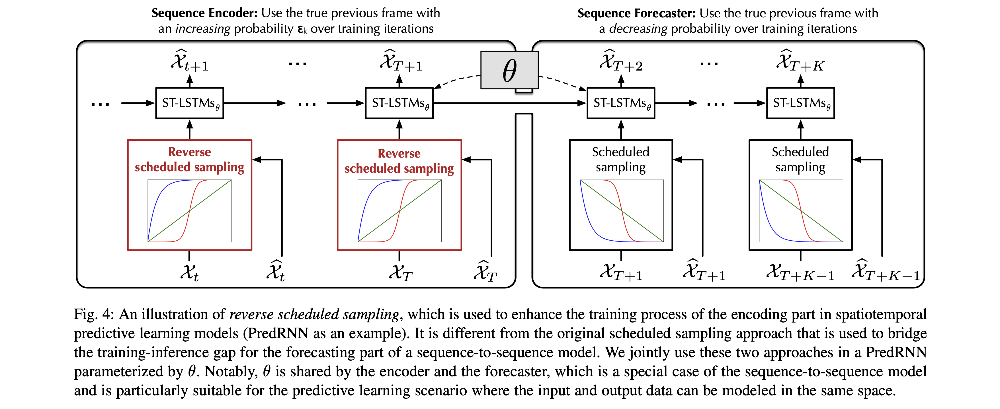
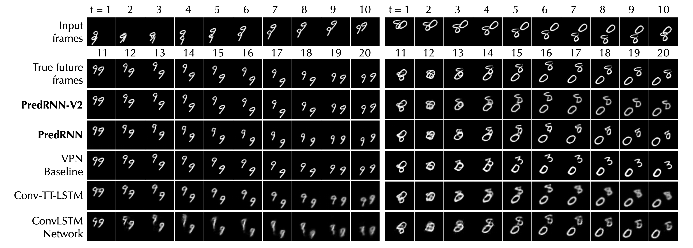
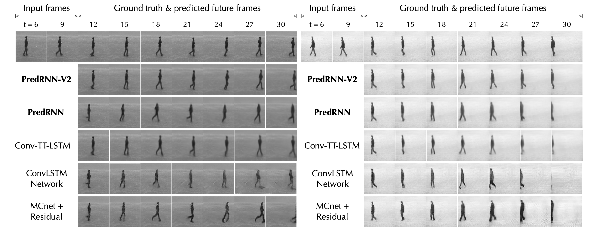

# PredRNN (NeurIPS 2017)

The predictive learning of spatiotemporal sequences aims to generate future images by learning from the historical context, where the visual dynamics are believed to have modular structures that can be learned with compositional subsystems

This repo first contains a PyTorch implementation of **PredRNN** (2017) [[paper](https://papers.nips.cc/paper/6689-predrnn-recurrent-neural-networks-for-predictive-learning-using-spatiotemporal-lstms)], a recurrent network with a pair of memory cells that operate in nearly independent transition manners, and finally form unified representations of the complex environment. 

Concretely, besides the original memory cell of LSTM, this network is featured by a zigzag memory flow that propagates in both bottom-up and top-down directions across all layers, enabling the learned visual dynamics at different levels of RNNs to communicate.

This repo also includes the implementation of **PredRNN-V2** (2021), a more powerful model for video prediction. 


## New in PredRNN-V2 (2021)

PredRNN-V2 is an extention of PredRNN (2017) in the following two aspects.

#### * Memory Decoupling

We find that the pair of memory cells in PredRNN contain undesirable, redundant features, and thus present a memory decoupling loss to encourage them to learn modular structures of visual dynamics. 


#### * Reverse Scheduled Sampling

Reverse scheduled sampling is a new curriculum learning strategy for seq-to-seq RNNs. As opposed to scheduled sampling, it gradually changes the training process of the PredRNN encoder from using the previously generated frame to using the previous ground truth. **Benefits:** (1) It makes the training converge quickly by reducing the encoder-forcaster training gap. (2) It enforces the model to learn more from long-term input context. 



## Prediction examples






## Get Started

1. Install Python 3.7, PyTorch 1.3, and OpenCV 3.4.  
2. Download data. This repo contains code for two datasets: the [Moving Mnist dataset](https://1drv.ms/f/s!AuK5cwCfU3__fGzXjcOlzTQw158) and the [KTH action dataset](http://www.nada.kth.se/cvap/actions/).  
3.  Train the model. You can use the following bash script to train the model. The learned model will be saved in the `--save_dir` folder. 
The generated future frames will be saved in the `--gen_frm_dir` folder.  
4. You can get **pretrained models** from [here](https://cloud.tsinghua.edu.cn/d/72241e0046a74f81bf29/).
```
cd mnist_script/
sh predrnn_mnist_train.sh
sh predrnn_v2_mnist_train.sh

cd kth_script/
sh predrnn_kth_train.sh
sh predrnn_v2_kth_train.sh
```

## Citation

If you use this repo or our results in your research, please remember to cite the following paper.
```
@inproceedings{wang2017predrnn,
  title={{PredRNN}: Recurrent Neural Networks for Predictive Learning Using Spatiotemporal {LSTM}s},
  author={Wang, Yunbo and Long, Mingsheng and Wang, Jianmin and Gao, Zhifeng and Philip, S Yu},
  booktitle={Advances in Neural Information Processing Systems},
  pages={879--888},
  year={2017}
}
```

## Related Publication
**PredRNN++: Towards A Resolution of the Deep-in-Time Dilemma in Spatiotemporal Predictive Learning.**  
Yunbo Wang, Zhifeng Gao, Mingsheng Long, Jianmin Wang, and Philip S. Yu. 
ICML 2018 [[paper](http://proceedings.mlr.press/v80/wang18b.html)] [[code](https://github.com/Yunbo426/predrnn-pp)]

## Contact
You may send email to yunbo.thu@gmail.com or longmingsheng@gmail.com, or create an issue in this repo and @wyb15. 

 
