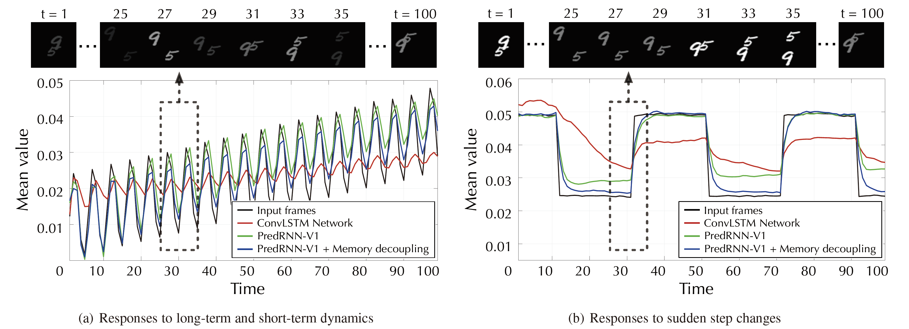

# PredRNN (NeurIPS 2017)

The predictive learning of spatiotemporal sequences aims to generate future images by learning from the historical context, where the visual dynamics are believed to have modular structures that can be learned with compositional subsystems

This repo first contains a PyTorch implementation of **PredRNN** [[paper](https://papers.nips.cc/paper/6689-predrnn-recurrent-neural-networks-for-predictive-learning-using-spatiotemporal-lstms)], a recurrent network with a pair of memory cells that operate in nearly independent transition manners, and finally form unified representations of the complex environment. Concretely, besides the original memory cell of LSTM, this network is featured by a zigzag memory flow that propagates in both bottom-up and top-down directions across all layers, enabling the learned visual dynamics at different levels of RNNs to communicate.


It also includes the implementation of **PredRNN-V2**, a more powerful model for video prediction and done in 2021. We strengthen the PredRNN in both memory decoupling and training strategy. This version achieves better prediction to various spatiotemporal dynamics.

## New in PredRNN-V2 (2021)

We present PredRNN-V2 by extending PredRNN (2017) in the following two aspects.

1. **Memory Decoupling**

In the original PredRNN (2017), we find that the pair of memory cells contain redundant features, which prevents the model from capturing modular structures of visual dynamics. We thus present a memory decoupling loss to unleash the respective strengths of the two 


Memory decoupling unleashes the respective strengths of  $C_t$ and $M_t$ for long-term and short-term dynamic modeling. With memory decoupling, PredRNN achieves more accurate responses to various dynamics.



2. **Reverse Scheduled Sampling**

In the training process of prediction networks, there is the discrepancy between encoder and forcaster part, which receives the ground truth and prediction results respectively. The prediction model will be overwhelmed because of this discrepancy in each sequence prediction.

We proposed a new training approach as **Reverse Scheduled Sampling(RSS)**. Different from previous, the input of the encoder is randomly sampled from both prediction results and ground truth in the beginning, and then gradually changes to all sampled from ground truth.


This approach bridges the gap between encoder-forcaster and makes the training convergence quickly. Besides, it also allows the model to dig more information from input frames. RSS shows strong performance in various dataset and can be used in the training of any prediction models.

## Get Started

1. Install Python 3.7, PyTorch 1.3, and OpenCV 3.4.  
2. Download data. This repo contains code for two datasets: the [Moving Mnist dataset](https://1drv.ms/f/s!AuK5cwCfU3__fGzXjcOlzTQw158) and the [KTH action dataset](http://www.nada.kth.se/cvap/actions/).  
3.  Train the model. You can use the following bash script to train the model. The learned model will be saved in the `--save_dir` folder. 
The generated future frames will be saved in the `--gen_frm_dir` folder.  
4. You can get **pretrained models** from [here](https://cloud.tsinghua.edu.cn/d/72241e0046a74f81bf29/).
```
cd mnist_script/
sh predrnn_mnist_train.sh
sh predrnn_v2_mnist_train.sh

cd kth_script/
sh predrnn_kth_train.sh
sh predrnn_v2_kth_train.sh
```

## Citation

If you use this repo or our results in your research, please remember to cite the following paper.
```
@inproceedings{wang2017predrnn,
  title={{PredRNN}: Recurrent Neural Networks for Predictive Learning Using Spatiotemporal {LSTM}s},
  author={Wang, Yunbo and Long, Mingsheng and Wang, Jianmin and Gao, Zhifeng and Philip, S Yu},
  booktitle={Advances in Neural Information Processing Systems},
  pages={879--888},
  year={2017}
}
```

## Related Publication
**PredRNN++: Towards A Resolution of the Deep-in-Time Dilemma in Spatiotemporal Predictive Learning.**  
Yunbo Wang, Zhifeng Gao, Mingsheng Long, Jianmin Wang, and Philip S. Yu. 
ICML 2018 [[paper](http://proceedings.mlr.press/v80/wang18b.html)] [[code](https://github.com/Yunbo426/predrnn-pp)]

## Contact
You may send email to yunbo.thu@gmail.com or longmingsheng@gmail.com, or create an issue in this repo and @wyb15. 

 
